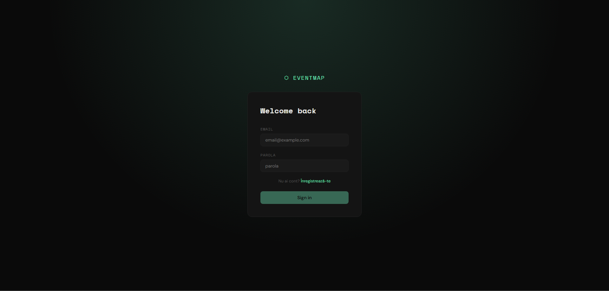
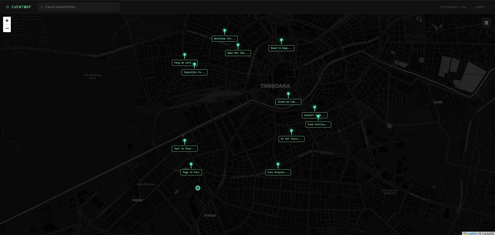
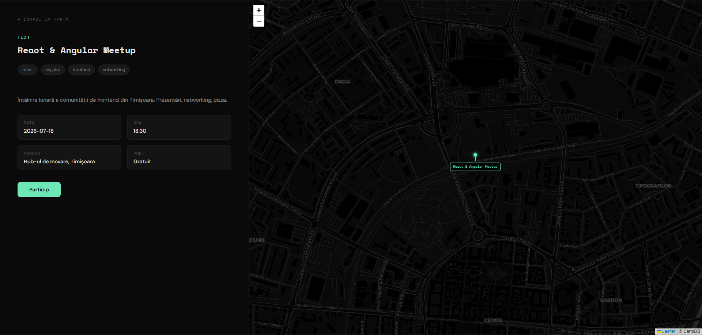

# ⬡ EventMap

A modern event discovery app built with **Angular 21** — find what's happening around you tonight.



---

## Overview

EventMap lets users discover local events on an interactive map. Browse events by location, filter by date, and get details instantly — built for people exploring a new city or looking for something to do tonight.



---

## Features

- 🗺️ **Interactive map** with custom markers powered by Leaflet
- 🔍 **Real-time search** — filters both map pins and sidebar list simultaneously
- 📅 **Date filters** — quick buttons (Today, Tomorrow, This Week) + date picker
- 📍 **Geolocation** — centers the map on the user's current location
- 🔐 **Auth flow** — login, signup with route guards protecting the map
- 📱 **Responsive** — sidebar becomes an overlay drawer on mobile
- 🎨 **Dark mode** — CartoDB dark tiles + custom dark UI



---

## Tech Stack

| | |
|---|---|
| Framework | Angular 21 |
| Map | Leaflet + CartoDB dark tiles |
| Styling | CSS with custom properties |
| Auth | Mock auth with localStorage persistence |
| State | Angular Signals |
| Forms | Reactive Forms with custom validators |

---

## Angular Concepts Used

- **Signals** — reactive state management
- **Services & DI** — `EventsService`, `AuthService` with `providedIn: 'root'`
- **Reactive Forms** — login/signup with custom `passwordsMatch` validator
- **Route Guards** — `authGuard` protecting `/map` and `/event/:id`
- **@Input / @Output** — component communication (search term, date filter, event selection)
- **ngOnChanges** — reacting to input changes for filtering
- **AfterViewInit** — initializing Leaflet after DOM is ready
- **ViewChild + ElementRef** — accessing the map DOM element
- **ngOnDestroy** — cleaning up Leaflet instance to prevent memory leaks
- **Custom Pipes** — `TruncatePipe` for marker labels
- **Routing with params** — `/event/:id` with `ActivatedRoute`

---

## Project Structure

```
src/app/
├── components/
│   ├── navbar/          # Search bar, user info, logout
│   └── sidebar/         # Event list, date filters, quick filters
├── guards/
│   └── auth.guard.ts    # Protects authenticated routes
├── interfaces/
│   └── event.ts         # AppEvent interface
├── pages/
│   ├── login/           # Reactive form with validation
│   ├── signup/          # Reactive form with password match validator
│   ├── map/             # Leaflet map + marker management
│   └── event-detail/    # Event info + mini map
├── pipes/
│   └── truncate.pipe.ts # Truncates marker labels
└── services/
    ├── auth.service.ts  # Mock auth with localStorage
    └── events.service.ts # Event data + search/filter logic
```

---

## Getting Started

```bash
# Clone the repo
git clone https://github.com/andrew-miroiu/event-map.git
cd event-map

# Install dependencies
npm install

# Start dev server
ng serve
```

Open `http://localhost:4200`

**Demo credentials:**
```
Email:    test@test.com
Password: 123456
```

---

## What I'd add next

- Replace mock data with a real REST API (Supabase or JSON Server)
- Category filters (Music, Sport, Tech)
- Animations on sidebar toggle
- Unit tests for services and guards